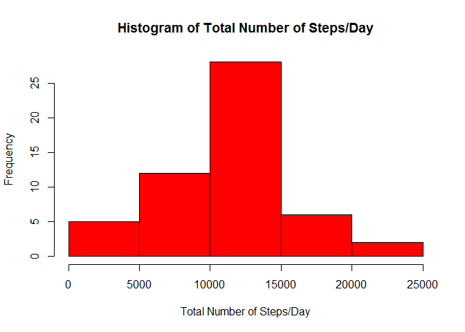
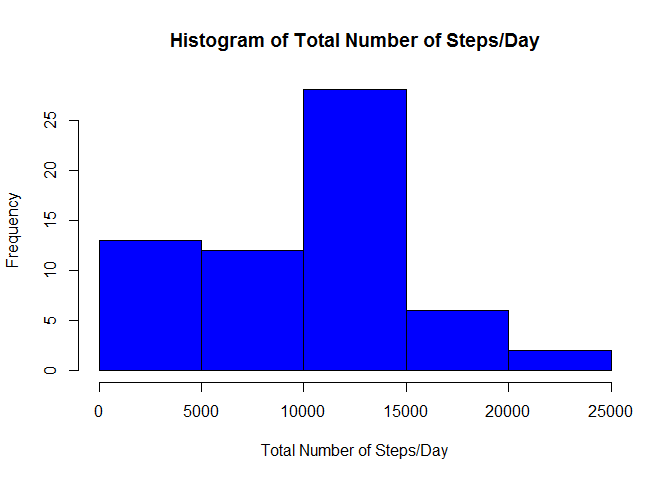
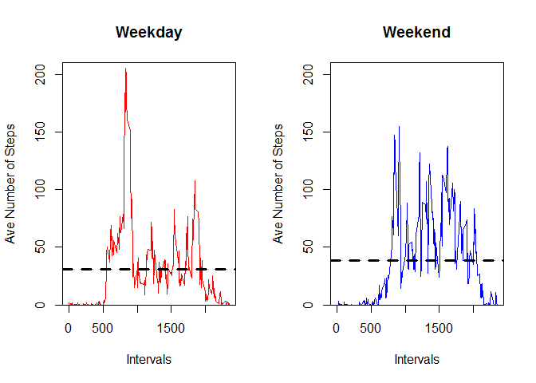
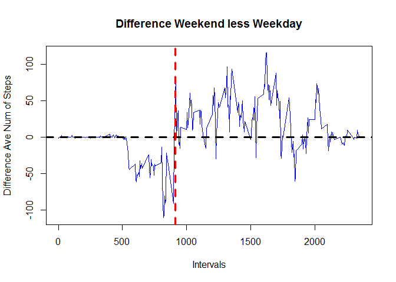

# Reproducible Research: Peer Assessment 1


## Loading and preprocessing the data

```r
##Read in csv file
data <- read.csv("activity.csv")
```
### No prepocessing was done on the data - read in "asis"

## What is mean total number of steps taken per day?  
### Created distribution of total number of steps taken each day of datatset and histogram plot of result: 

```r
library(plyr)
## The distribution of total number of steps taken each day ("one")
one <- ddply(data, "date", summarise, Tot_Num_Steps = sum(steps), mean_steps = mean(steps), median_steps = median(steps))
## Histogram of the total number of steps taken each day
hist(one[,2],col = "red", xlab = "Total Number of Steps/Day", main = "Histogram of Total Number of Steps/Day")
```



### The missing data coded as NA are complete days in the dataset - meaning all measures for the day were not made.
### There are 8 days like this out of 61 total days or 53 days with complete measurements.  

### The mean and median of steps taken during a day are shown below: 

```r
mean_total_num_steps <- mean(one[,2], na.rm = TRUE)
median_total_num_steps <- median(one[,2], na.rm = TRUE)
out <- data.frame(mean_total_num_steps, median_total_num_steps)
out
```

```
##   mean_total_num_steps median_total_num_steps
## 1             10766.19                  10765
```

### Then mean and median are almost the same usually meaning the distribution is fairly symmetric about the average.
## What is the average daily activity pattern?

### The time series plot of average values (all days) across intervals (5 min) is shown below:

```r
## The distribution of total number of steps taken by interval (mean and median at each interval as well)
two <- ddply(data, "interval", summarise, Tot_Num_Steps = sum(steps, na.rm = TRUE), mean_steps = mean(steps, na.rm = TRUE), median_steps = median(steps, na.rm = TRUE), N = Tot_Num_Steps/mean_steps)
## Time series plot mean value versus intervals (5 minute each)
plot(mean_steps~interval, two, type = "l")
```


### The maximum average and interval (across all days) where maximum occured:

```r
two[two[,3]==max(two[,3]),][,c(1,3)]
```

```
##     interval mean_steps
## 104      835   206.1698
```

## Imputing missing values


```r
##The number of missing values in the dataset
cnt <- count(data, "steps")
numNAs <- cnt[length(cnt[,1]),2]
```
### The number of missing values in the dataset is **2304**.

### Strategy for imputing missing values in the dataset and create new dataset implementing strategy using the median by interval to fill in missing values (over 62% of measures are zero)
### Created "data1" from original "data" with the imputed medians replacing the missing values (NA's)

```r
a <- is.na(data[,1])
index <- 1:length(a)
rows <- index[a]
tempdata<-data[rows,]
data2 <- join(tempdata, two, by='interval')
## Create the new dataset with the imputed values - medians for each interval excluding the NA's
data1 <- data
data1[rows,1] <- data2[,6]
## The distribution of total number of steps taken each day ("three")
three <- ddply(data1, "date", summarise, Tot_Num_Steps = sum(steps), mean_steps = mean(steps), median_steps = median(steps))
## Histogram of the total number of steps taken each day
hist(three[,2], col = "blue", xlab = "Total Number of Steps/Day", main = "Histogram of Total Number of Steps/Day")
```



### The mean and median of steps taken during a day are shown below: 

```r
mean_total_num_steps2 <- mean(three[,2])
median_total_num_steps2 <- median(three[,2])
out <- data.frame(mean_total_num_steps2, median_total_num_steps2)
out
```

```
##   mean_total_num_steps2 median_total_num_steps2
## 1              9503.869                   10395
```
### The difference between the original and imputed 

```r
## Difference in mean and median using imputed values
mean_diff <- mean_total_num_steps2 - mean_total_num_steps
median_diff <- median_total_num_steps2 - median_total_num_steps
perc_mean_change <- mean_diff/mean_total_num_steps
perc_median_change <- median_diff/median_total_num_steps
out <- data.frame(mean_diff, perc_mean_change, median_diff, perc_median_change)
out
```

```
##   mean_diff perc_mean_change median_diff perc_median_change
## 1  -1262.32       -0.1172485        -370        -0.03437065
```
### *You can see the mean usng the imputed values has decreased about 12% and median decreased less so about 3.5% decline - you can see the from the histograms that the imputed values have shifted the distribution towards the left or to lower values where the mean is less than the median (negative skewness).*

## Are there differences in activity patterns between weekdays and weekends?

### Created a factor variable called "week_days" - "weekday" (Mon to Fri) or "weekend" (Sat and Sun) and times series panel plot of each factor level: 

```r
## Create a new factor variable two levels weekday or weekend for dates ("data1"):
days_of_week <- weekdays(as.Date(data1[,2], "%Y-%m-%d"))
data1 <- cbind(data1, days_of_week)
days_of_week <- c("Monday", "Tuesday", "Wednesday", "Thursday", "Friday", "Saturday", "Sunday")
week_days <- c(rep("weekday",5), rep("weekend",2))
lookup <- cbind(days_of_week, week_days)
lookup <- data.frame(lookup)
data1 <- join(data1, lookup, by='days_of_week')
datawkday <- data1[,5]=="weekday"
datawkend <- data1[,5]=="weekend"
data1wkday <- data1[datawkday,]
data1wkend <- data1[datawkend,]

## The distribution of total number of steps taken by interval:
## Four1 is for the weekday days
four1 <- ddply(data1wkday, "interval", summarise, Tot_Num_Steps = sum(steps, na.rm = TRUE), mean_steps = mean(steps, na.rm = TRUE), median_steps = median(steps, na.rm = TRUE), N = Tot_Num_Steps/mean_steps)
four1 <- cbind(four1, week_days = rep("weekday", dim(four1)[1]))
## Four2 is for the weekend days
four2 <- ddply(data1wkend, "interval", summarise, Tot_Num_Steps = sum(steps, na.rm = TRUE), mean_steps = mean(steps, na.rm = TRUE), median_steps = median(steps, na.rm = TRUE), N = Tot_Num_Steps/mean_steps)
four2 <- cbind(four2, week_days = rep("weekend", dim(four2)[1]))
## Four3 is for all days
four3 <- rbind(four1, four2)
## Difference between Weekdays and Weekends over intervals - create dataframe of differences in average number of steps by interval
fourdiff <- data.frame(cbind(four1[,1], four1[,3], four2[,3], four2[,3]- four1[,3]))
names(fourdiff) <- c("interval", "weekday", "weekend", "difference")
## Mean and Median of intervals by factor - Weekday and Weekend (also in Total)
Mean <- c(mean(four1[,3]), mean(four2[,3]), mean(four3[,3])) 
Median <- c(median(four1[,3]), median(four2[,3]), median(four3[,3]))
Time_of_Week <- c("weekday", "weekend", "both")
df <- data.frame(Mean, Median, Time_of_Week)

## Create Panel plot differentiating between
## Time series plot mean value versus intervals (5 minute each)
par(mfrow = c(1,2))
plot(mean_steps~interval, four3, subset=(week_days=="weekday"),xlab="Intervals",ylab="Ave Number of Steps",main="Weekday",type="l", col="red", ylim = c(0,210), yaxs ="i")
abline(h = df[1,1], col = "black", lty = 2, lwd = 3)
plot(mean_steps~interval, four3, subset=(week_days=="weekend"),xlab="Intervals",ylab="Ave Number of Steps",main="Weekend",type="l", col="blue", ylim = c(0,210), yaxs ="i")
abline(h = df[2,1], col = "black", lty = 2, lwd = 3)
```



```r
df
```

```
##       Mean   Median Time_of_Week
## 1 31.15448 20.77778      weekday
## 2 38.18880 28.15625      weekend
## 3 34.67164 24.01528         both
```
### The average weekend number of steps exceeds the average for weekdays by about 22% (38.2/30.2).  Similarly for the median where the weekend is 35% (28.1/20.8) greater than weekdays.  

### A plot of the difference between the weekend activity (number of steps) versus the weekdays is shown below:

```r
par(mfrow = c(1,1))
plot(difference~interval, fourdiff, xlab="Intervals",ylab = "Difference Ave Num of Steps", main = "Difference Weekend less Weekday",type="l", col="blue")
abline(h = 0, col ="black", lwd = 3, lty = 2)
abline(v = 910, col ="red", lwd = 3, lty = 2)
```



### The chart shows the difference in average number of steps between weekend and weekdays over the 5 minute intervals also plotted are the zero line (horizontal) and also a vertical line where the weekend starts to dominate the activity relative to the weekday.  It seems to occur at about 9 a.m. in the morning - prior to this the weekday activity is greater than the weekend (of course you notice that the time period from midnoght to 5 a.m has almost no activity).  After 9 a.m. the weekend almost in every instance (interval) exceeds the activity of the weekdays.  
